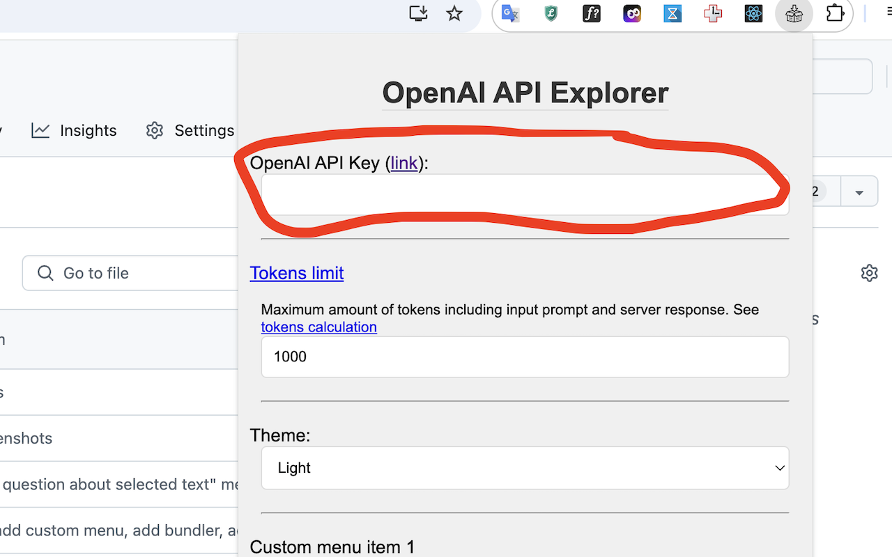
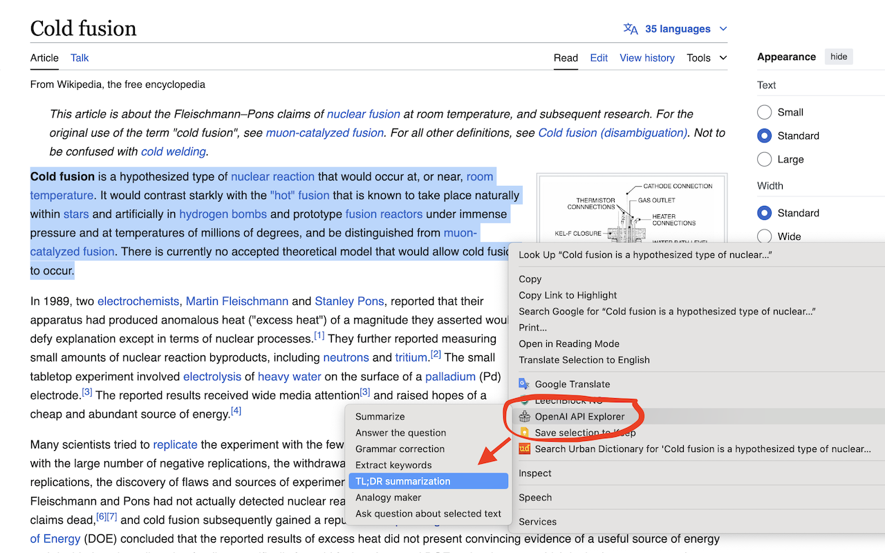
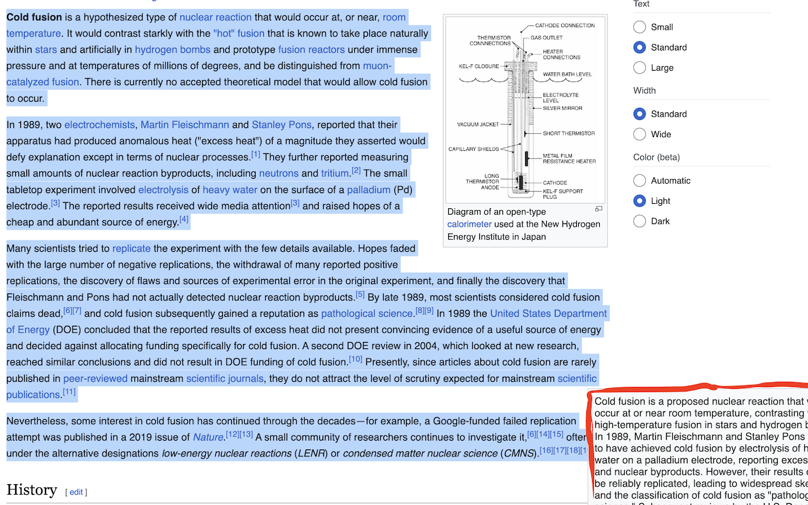

# OpenAI API Explorer - TextAigist: Chrome Extension

This is a simple Chrome extension that uses the OpenAI ChatGPT API to summarize selected text on a webpage. The summarized text is then displayed in an alert.

## Setup

1. Clone this repository to your local machine.
2. Navigate to `chrome://extensions/` in your Chrome browser.
3. Ensure that the Developer mode checkbox in the top right-hand corner is checked.
4. Click Load unpacked extension… to pop up a file-selection dialog.
5. Navigate to the directory in which your extension files live, and select it.

## Configuration

This extension requires an OpenAI API key to function. Here's how to set it up:

1. Navigate to the [OpenAI website](https://www.openai.com/) and create an account if you don't have one already.
2. Once you're logged in, go to the API section and generate a new API key [here](https://platform.openai.com/account/api-keys).
3. Click on the extension icon in your Chrome browser and paste your API key into the text field, then click "Save".

Your extension is now ready to use! Simply select some text on a webpage, right-click, and choose "Summarize with ChatGPT" to see a summary of the selected text.

## Security

Please note that your OpenAI API key is sensitive information and should be kept secure. This extension stores your API key in Chrome's local storage, which is not accessible by other extensions or webpages. 

## Rate Limiting

Please be aware that making too many requests to the OpenAI API in a short period of time can lead to your API key being rate-limited. If you encounter this issue, you may need to wait a while before you can make more requests.

## Contributing

Contributions are welcome! Please feel free to submit a pull request or open an issue if you encounter any problems or have any suggestions for improvements.
